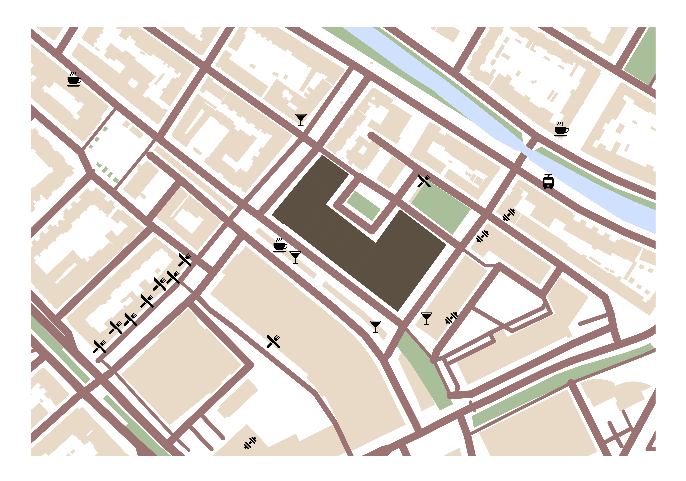
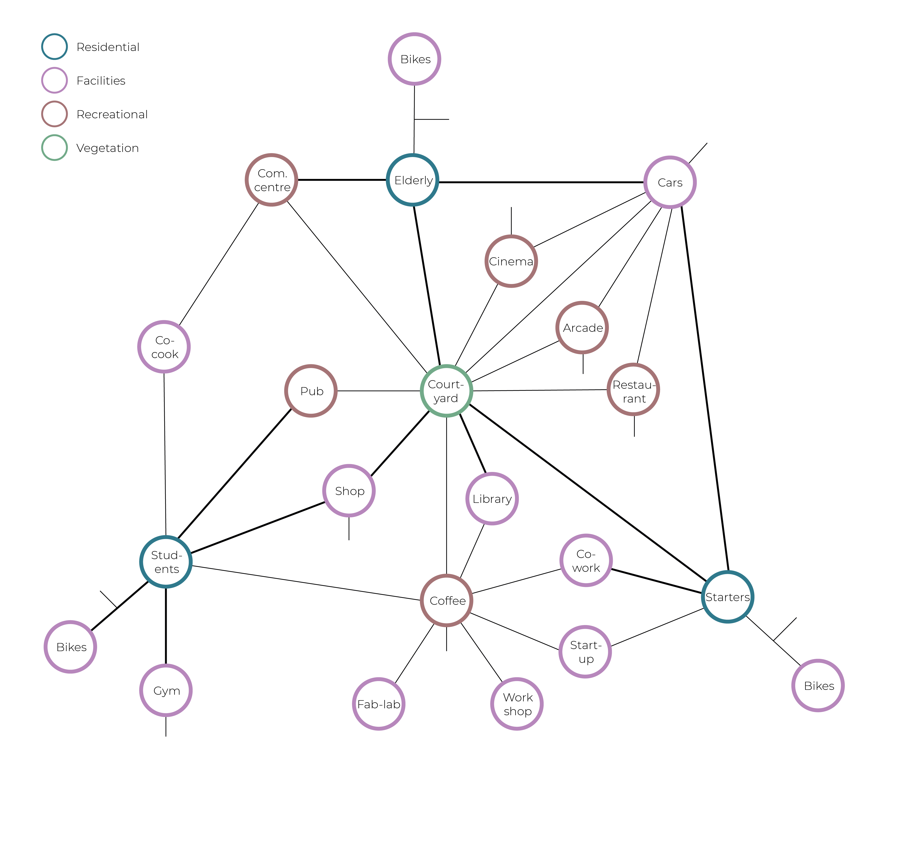
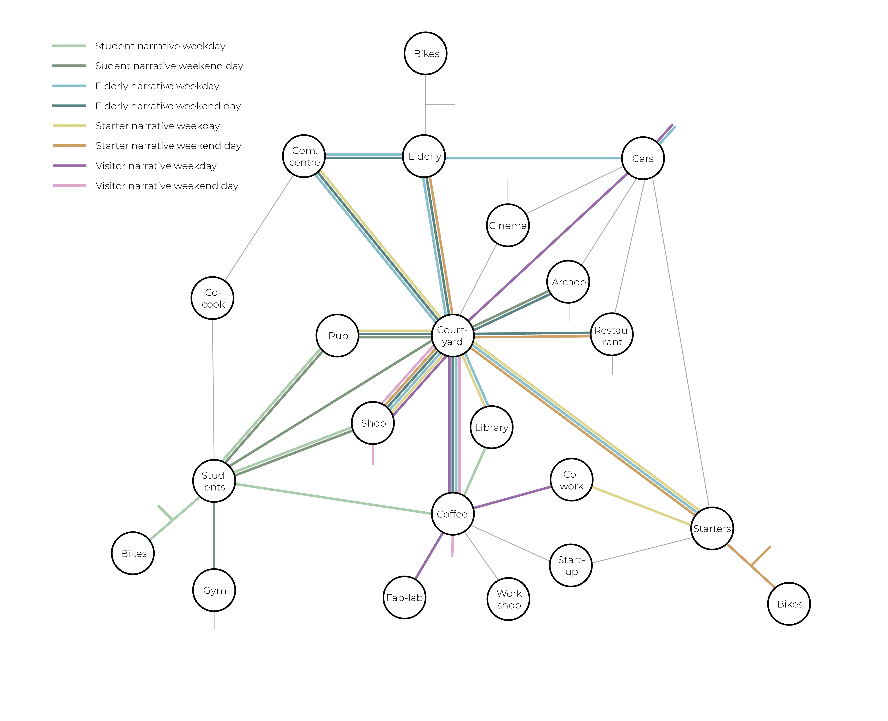

# Planning

## Process

### Context analysis
Before diving in to the code and the notebooks, we did a little analysis of the location. In the map below, the position of our plot in the city of Rotterdam is shown. (Scale 1:10000)

    

In this next map, we zoom in a little more and highlight the already existing facilities surrounding our potential building. (Scale 1:1500)

    

### Design goals

## Products
### Metro network: Connections
The graph below shows how the possible connections that can be formed between the different facilities in our building.

    

### Metro network: Narratives
In the graph below, the narratives we created to test our metro network are shown. We took a day of the week and a day of the weekend for every user group and put it in the metro network.

    

### Narratives
##### Student

*Week day*

“I am currently studying to get a master’s degree in philosophy. Due to the coronavirus, I have to do the majority of my study from home. I start my day by having breakfast with my roommates. Afterwards, I go to the coffee corner to get some coffee to fuel the day ahead. I always study in the library because I think it’s important to have a separation between work and recreation. I took lunch to the library since I can’t afford the time it takes to have lunch. After a long day of studying, I go past the shop before going home to get dinner. After having dinner at home, I go to the cafe to meet up with some friends living in the neighbourhood. I go back home around 10 o’clock and watch some Netflix in bed.”

*Weekend day*

“On Saturday mornings, my girlfriend and I always sleep in. We start our day by going to the shop together to get some breakfast. We eat our breakfast at home, and since we both enjoy working out, we decide to go to the gym. After our workout, we go back home to take a shower. The weather is very nice today, so we sit outside in the garden for a bit and get a drink at the cafe. After our drinks, we go to the arcade to play some games. We are both very competitive. We decided to have dinner at home today. After dinner, we stayed at home to clean up the house and chill.”

---

**Elderly**

*Week day*

“In the morning we start our day with some breakfast from the shop. Each day 
we walk together to the shop at around 10 o’clock. My partner has a walker, so it’s nice that everything is close by and we can use the elevator. On our way back we stop by the community centre to talk to my neighbours. After breakfast, we often go to the park with some friends from the building. We walk to the coffee corner to get some drinks while we are sitting near the park. On our way back everyone goes to their house by using the community centre. In the afternoon we go to a town to have lunch. When we arrive at the building, we park our car and walk to our house. I will go to the library to read some books while my partner is catching up on some sleep. I go to the shop to get the ingredients for dinner and I visited a nice family who is staying in a starter house. We eat and then go to bed.” 

*Weekend day*

“I live by myself in one of the assisted living houses. I start my day by going to the shop to get breakfast. I eat my breakfast at home and clean up my house in the morning. After lunch, I go to the garden to meet one of my best friends. We go to the coffee corner together to get some coffee. During our coffee, we decide to have dinner at the restaurant. After dinner, I say goodbye to my friend and go to the cafe to meet with a few ex-colleagues. We had a few drinks, and decided it would be fun to go to the arcade. On my way back home I go past the community centre to say hello to a few people. After a long day of social interactions, I go back home and head straight to bed.”

---
##### Starters

*Week day*

“Usually I work in the office, but with Covid-19 still going on, I work from home two days a week, like today. I started my day by making breakfast and going for a quick run through the park and the neighbourhood. After showering and changing quickly at home, I got some coffee at the coffee corner on my way to the co-working spaces. At lunchtime I walked home to have my break, that’s one of the perks of living close to the workspaces. After my break, I went back to the co-working spaces to continue my work until 5:30 pm. I quickly picked up some new books from the library and then I texted some of the students I still know from when I studied to see if they wanted to meet up and have dinner together. We met up at the community centre to walk to the shop to go grocery shopping and then walk to my home which has a pretty roomy kitchen that fits us all perfectly. After dinner, we decided to go for a beer at the pub, since it’s a Friday evening. We stayed there for a pretty long time, but we had a lot of fun. After a short walk, I was back home, ready to go to bed.”

*Weekend day*

“Saturdays for us are for family activities. We start the day off by having breakfast at home which takes quite long with two young kids. After we finished getting the kids and ourselves ready, we went for a bike ride through the city. On the way to the bike parking, we stopped at the shop to get some snacks for the bike ride. After a nice, long ride, we put our bicycles in the parking lot again and went to the restaurant to have a luxurious lunch. We decided to visit the kids’ grandmother in the assisted living units. When we got home, we decided to have a nice easy meal and order some pizza, so we don’t have to go out anymore for groceries after this tiring day.”

---
##### Visitors

*Week day*

⋅⋅⋅“Today I am going to work in the fab labs and co-working space. I arrive by car and go to the fab labs straight away since I’m a bit late for work. My colleagues and I oversee everything that’s happening there. After lunch I go to the co-working space with a collegue of mine to do some paperwork. I finish work around 5 o’clock. I then quickly hop into the shop to get some groceries for dinner, which I’m going to cook at home. I walk back to my car and leave for the day.”

*Weekend day*

“I live in the neighbourhood and I often spend part of my weekend days in this building. I use a lot of the facilities and this building really adds something to the neighbourhood. I arrive in the afternoon, after having lunch at home. My friend and I meet up at the coffee corner to get some drinks. We then go to the garden to enjoy the sunshine. Since it started raining today, we decided to go to the community centre, since a friend of ours lives in this building. This way we can spend time together, without having to spend any money on food or drinks. After chilling for a bit, I go to the shop to get groceries and then I go back home.”

---