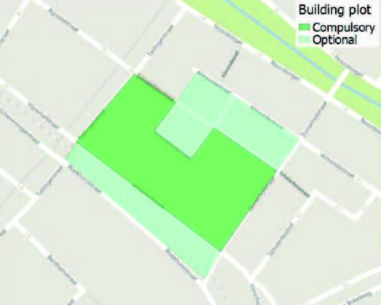
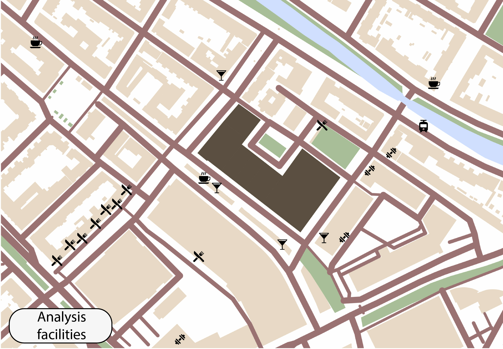
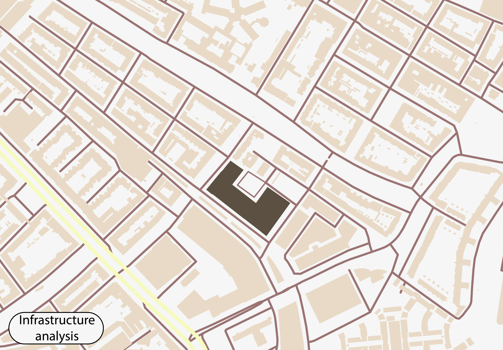
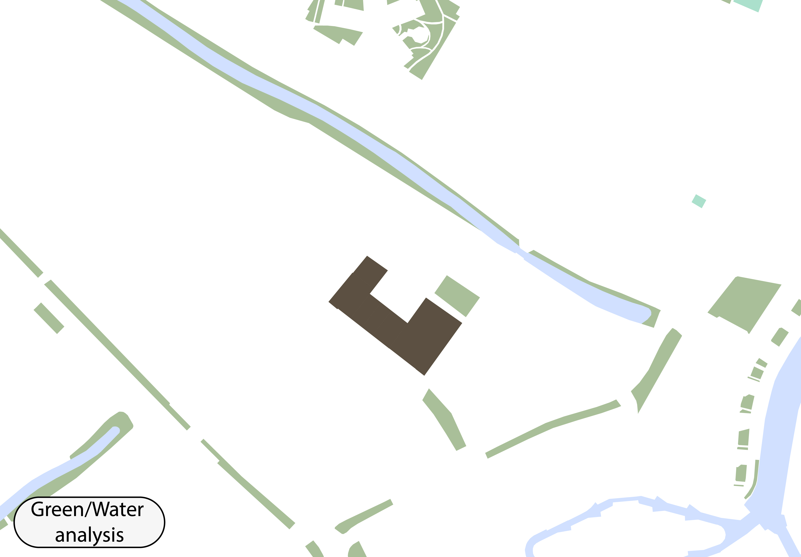

### Context analysis
Before diving in to the code and the notebooks, we did a little analysis of the location. In the maps below, the position of our plot in the city of Rotterdam is shown. Furthermore, the facilities, infrastructure and nature surrounding our buidling are shown. Finally, a simplified solar path is presented to get a sense of what influence the sun has on the plot.

#### Building plot

    

#### Overview of the location (large scale)

    

As you can see on the overview of the location, the plot is situated in the city of Rotterdam. This means that the plot is surrounded with buildings. It is also interesting to see that the trainstation is nearby, as well as a busy road. It could be interesting to see what the influence is of the noice in the area on the building and if this noice is significant, it would be relevant to use this in our calculations. 

#### Overview of the location (small scale)

    

When looking closer to the building plot, a few things stand out. Firstly, in the north of the building you can see a little canal. The canal is surrounded by greenery. This canal is the only place where water is running in the area. There is also a small place of greenery closer to the building. It could be nice to see if we can connect this small place with greenery with the building, for instance with a park that will lie against the existing greenery. This would create a nice place where you can't see the transition between both parks.      

#### Overview of the facilities

    

We also took a look at the facilities in the neighbourhood. This is interesting because there are a lot of different types of facilities already in the neighbourhood. Especially because this building has also certain facilities, it could be nice to see if we could place these facilities in spaces in the building that aren't covered by the current facilities of the neighbourhood. One thing that really stands out is the road with a lot of restaurants all together. There aren't so many restaurants and facilities surrounded by greenery, so maybe our building can help stimulate the neighbourhood by using a lot of green and combine that with different facilities. 

#### Overview of the infrastructure

    

During the analysis of the infrastructure we saw that the most important street of the neighbourhood is at the south side of the building. This picture makes it also clear that the building is surrounded by streets. The only place where people can walk is around the canal. It could be an interesting idea to make a public space more car-free and focus more on bicycles and pathways for pedestrians. 

#### Overview of surrounding nature

    

The greenery in the area consists for the most part of low quality. Most of the green parts are just filling up empty space between streets and buildings. There are only a few places where the quality of the greenery is high. If you look at the amount of water in the neighbourhood, you notice that the area is very paved. A lot of public urban space is covered with stones. This could create a problem for the sewage system. We think that it is important that our building can collect the water that is falling on the plot, to make sure that the sewage system is relieved.  

#### Overview of the solar path

    

Finally, we looked at a simplified solar path to see what the impact roughly can be on our project building. To get an even better picture of the influence of the sun, we looked at the heights of the surrounding buildings. During this analysis, we found out that the tallest building is situated on the south side of the plot. This means that some of the sunlight will be blocked by a surrounding building. We think that it is important to take this into account during our calculations because it could influence how much sun is falling on the surface of our building.  

### Design goals
We want to create a building that is designed for sustainability, in multiple ways. Our building should have the following characteristics:

+ Clear separation between private and public areas (Clustering)

+ Clear separation between private facilities and public facilities

+ Neighbourhood enrichment; mixed-use(rs), gathering of different types of people

+ Specific focus on the following sustainable topics:

    + socially; foster social interactions, but don’t force people
    + energy efficient; energy generation instead of consumption
    + energy efficient; materials, waste, compact area of facades
    + methodology; modularity, circularity 
    + embedded technology; water storage, heat stress reduction, biodiversity

---

   

---