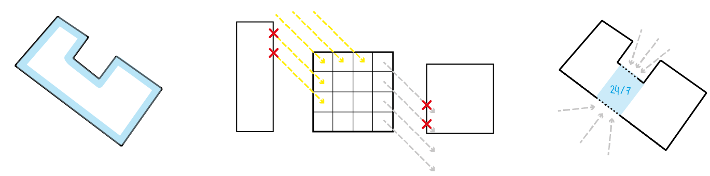
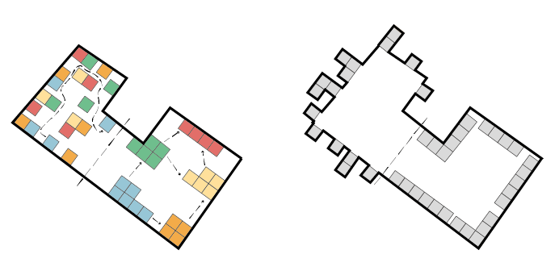

## Process

###  Design principles
To further eloborate on the design goals, we came up with 3 main principles and used those to give us a directin in which we want to go and what code we had to produce.
### Neighbourhood Enrichment
The first principle is Neighbourhood improvement. By making a building that does not block the sun for surrounding buildings, and vice versa, that provides easy access to the public facilities like the pub or the cinema by putting them close to the facade, and provides a 24/7 meeting place, we want to reach this first principle.

    

### Efficiency
blahblahlah efficiency clustering etc

    

### Sustainability
The last principle is sustainability. To achieve a sustainable building, we want to integrate a facade that is dismountable so that the sustainable materials can be re-used. We also want to implement a passive energy concept. In the winter, we try to warm the building with the heat of the sun to use the least possible artificial heating, and in the summer, we try to use the least cooling systems.

    

