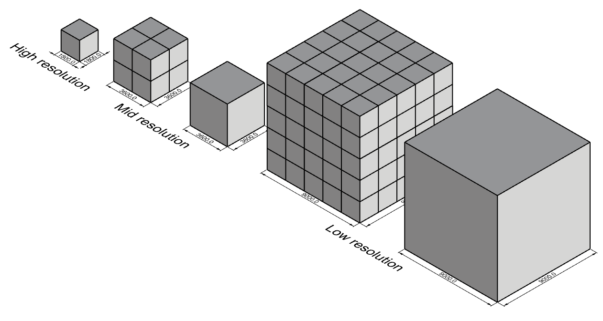

### Voxelsize

During our research for a good voxelsize, we first looked at previous groups. 

Other groups | High Resolution | Low resolution
---------|---------|---------
Apidae | 1800 x 1800 x 1800 mm | 15000 x 15000 x 15000 mm
Zoho’s pearl | 3600 x 3600 x 3600 mm | 14400 x 14400 x 14400 mm
CUB3D | 3240 x 3240 x 3240 mm	
Green valley | 900 x 900 x 900 mm | 1800 x 1800 x 1800 mm, 3600 x 3600 x 3600 mm
Zoho | 3000 x 3000 x 3000 mm
Oasis: | 3600 x 3600 x 3600 mm

We wanted to choose a voxelsize that eases the construction of the façade with certain measures. This would create a almost like lego ‘click and go’ principle for elements we wanted to place on the façade. By standardising the measures of the architectural elements we could swap different tiles in the same place. We started with the low resolution voxelsize. This size needed to be large enough to make fast calculations, but also small enough to make the model as realistic as possible. We found out that 9000x9000x9000mm was the right voxelsize for this resolution. This voxelsize was compared with other groups smaller, but this created a more realistic envelope which we used for the calculations. Our calculations cost us a little bit more time because the voxelsize was smaller, but we difference in calculation time was not significant. 

When we chose the low resolution voxelsize, we investigated the high resolution voxelsize. We wanted to make this voxelsize a multiple of what would fit in the 9000x9000x9000mm voxel. We also looked at the previous groups for some inspiration. Next to this, we thought about the corridors we needed to implement in the building. Our aim was to make a stairway that was wide enough for at least three people to use at the same time. We chose this because the stairways are the places where the people from different facilities come together. To facilitate all the movement in the building, we wanted to make sure that there is enough space for everyone to go from a to b. In the book ‘the human scale’ the staircase needs to be 1800mm wide. This size is the one we used for the staircase. A voxelsize of 1800x1800x1800mm was in our eyes not very handy because of the height of the voxel. We would need two voxels on top of each other to meet the height of the floor. Therefore, we wanted to make the voxel a little bit bigger than 1800mm. We figured that if we would multiply the voxelsize of 1800mm by two, we could fit an entire staircase in one voxel. In addition to this, the problem with the height of the voxelsize would also disappear. As icing on the cake, 3600x3600x3600mm fits also in the low resolution voxelsize we wanted to use for the early calculations. That’s why we chose to use 3600x3600x3600mm as the voxelsize for our high resolution. 
