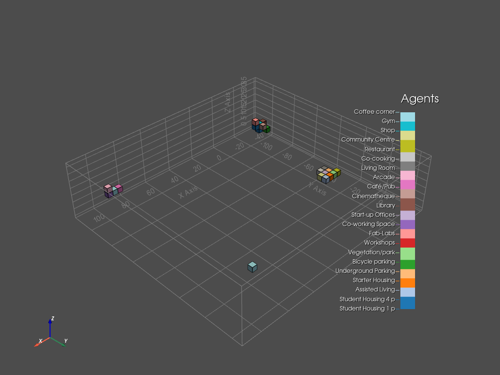
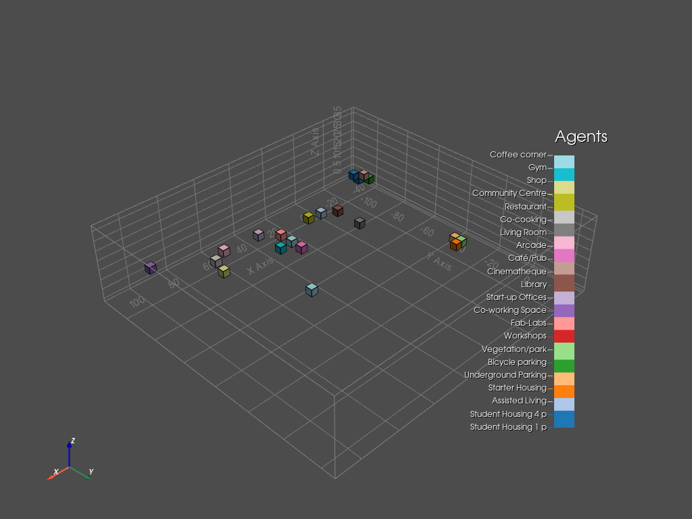

# **The Agent Based Model**

## **Description (Objectives)**
### **Criteria for the agent based model**

* Value fields
    1. Noise
    2. Distance to the facade
    3. Distance to the entrance
    4. Sky view factor
* Closeness to other agents  
* Squareness of the space

### **Extra function for the agent based model**

* When the agent has grown to the required space needed, they can grow like a "greedy snake," such that they can compare the inner voxels with the free neighbors to choose move or not.

## **The input of the agent based model**

### **Agent Preferences**

Originally, all preferences range between 0 and 1. For simplification and unification of the calculating process, every of them will be multiplied by a unique constant to balance the scale difference in value fields.  

For the value field of **noise_field**, **dist_entrance**, and **dist_fac**, the value will be multiplied by -1 in addition, since a lower value in fields corresponding to a higher value in the evaluation equation.

*(The following table is only for illustration, which is the head of the original full table)*

| space_name          | space_id | noise_field | dist_entrance | dist_fac | sunlight | skyview |
|---------------------|----------|-------------|---------------|----------|----------|---------|
| Student Housing 1 p | 0        | 0.4         | 0.55          | 0.87     | 0.8      | 0.6     |
| Student Housing 4 p | 1        | 0.4         | 0.55          | 0.87     | 0.8      | 0.6     |
| Assisted Living     | 2        | 0.8         | 0.4           | 0.93     | 0.8      | 0.8     |
| Starter Housing     | 3        | 0.6         | 0.6           | 0.93     | 0.8      | 0.6     |

### **Value fields**

Value fields are read as a dictionary where keys contain the names and values contain lattices of corrsponding values.

```python
fields = {}
for f in program_prefs.columns:
    lattice_path = os.path.relpath('../Data/dynamic output/' + f + '.csv')
    fields[f] = tg.lattice_from_csv(lattice_path)
```

### **Adjacency matrix**

We do not do any changes here for the adjacency matrix, the column and row index are aligned with the corresponding space_id (agent_id).

|    | 0   | 1   | 2   | 3   | 4   | 5   | 6   | 7   | 8   | 9   | 10  | 11  | 12  | 13  | 14  | 15  | 16  | 17  | 18  | 19  | 20  | 21  |
|----|-----|-----|-----|-----|-----|-----|-----|-----|-----|-----|-----|-----|-----|-----|-----|-----|-----|-----|-----|-----|-----|-----|
| 0  | 1   | 0.1 | 0   | 0   | 0   | 0.6 | 0.1 | 0   | 0   | 0   | 0   | 0.1 | 0   | 0   | 0.3 | 0.2 | 0   | 0   | 0   | 0.9 | 0.9 | 0.1 |
| 1  | 0.1 | 1   | 0   | 0   | 0   | 0.6 | 0   | 0   | 0.1 | 0   | 0   | 0.3 | 0.2 | 0.8 | 0.2 | 0   | 0.3 | 0.2 | 0   | 0.8 | 0   | 0.6 |
| 2  | 0   | 0   | 1   | 0.4 | 0.2 | 0   | 0.1 | 0.2 | 0   | 0   | 0   | 0.1 | 0   | 0   | 0.1 | 0.1 | 0.1 | 0.2 | 0.6 | 0.3 | 0.1 | 0   |
| 3  | 0   | 0   | 0.4 | 1   | 0.9 | 0   | 1   | 0   | 0.1 | 0.8 | 0.2 | 0.2 | 0.2 | 0.6 | 0.2 | 0.2 | 0   | 0.2 | 0.3 | 0.9 | 0.6 | 0   |


## **Placement of the original location**

To start the agent based growth, we need to have the original location of those agents. It could be done in completely random, however that will be not suitable especially when we have a relatively large amount of agents. We designed a specific algorithm for the original location.

### **Ordering agents**

The first thing to decide is who can be placed first. We now assume that the most important agents are those who take more spaces. As a result, we first order those agents based on their designated areas/volumes.

```python
sizes_complete = sizes_complete.sort_values(by = 'Area', ascending = 0)
program_complete = program_complete.sort_values(by = 'Area', ascending = 0)
```

### **Calculating preference values**

For each agent, we calculate their perference value for every voxel available and take voxel corresponding to the largest value. Then we assign the voxel to it and update the available lattice.

```python
avail_index = np.array(np.where(avail_lattice)).T
a_eval = np.ones(len(avail_index))
for f in program_prefs.columns:
    vals = fields[f][avail_index[:,0], avail_index[:,1], avail_index[:,2]]
    a_weighted_vals = vals ** a_prefs[f]
    a_eval *= a_weighted_vals
```

However we later find this not enough. The result of this simple algorithm will centralize agents together, which imposes difficulty of some agents to grow.

<center>
    
</center>

### **The new restriction**

So a new restriction on the allowed number of occupied neighborhoods is added. If more than 1 of the neighborhoods are occupied, the algorithm will automatically search for the next best location, until the condition is satisfied.

```python
    n = 1
    while True:
        fns = avail_lattice.find_neighbours_masked(stencil, loc = selected_ind)
        blocked = 0
        for n in fns:
            neigh_3d_id = np.unravel_index(n, avail_lattice.shape)
            if occ_lattice[neigh_3d_id] != -1:
                blocked += 1
        if blocked >= 2:
            selected_int = np.argsort(-a_eval,axis=0)[n]
            selected_ind = avail_index[selected_int]
            n += 1
        else:
            break
```

The resulting original locations are much more suitable for an agent based growing model.

<center>
    
</center>

## **The Agent Based Model**