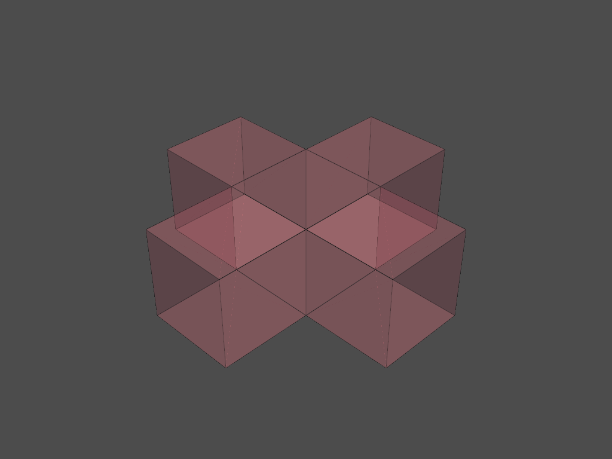

# **The Agent Based Model**

## **Description (Objectives)**
### **Criteria for the agent based model**

* Value fields
    1. Noise
    2. Distance to the facade
    3. Distance to the entrance
    4. Sky view factor
* Closeness to other agents  
* Squareness of the space

### **Extra function for the agent based model**

* When the agent has grown to the required space needed, they can grow like a "greedy snake," such that they can compare the inner voxels with the free neighbors to choose move or not.

## **The input of the agent based model**

### **Agent Preferences**

Originally, all preferences range between 0 and 1. For simplification and unification of the calculating process, every of them will be multiplied by a unique constant to balance the scale difference in value fields.  

For the value field of **noise_field**, **dist_entrance**, and **dist_fac**, the value will be multiplied by -1 in addition, since a lower value in fields corresponding to a higher value in the evaluation equation.

*(The following table is only for illustration, which is the head of the original full table)*

| space_name          | space_id | noise_field | dist_entrance | dist_fac | sunlight | skyview |
|---------------------|----------|-------------|---------------|----------|----------|---------|
| Student Housing 1 p | 0        | 0.4         | 0.55          | 0.87     | 0.8      | 0.6     |
| Student Housing 4 p | 1        | 0.4         | 0.55          | 0.87     | 0.8      | 0.6     |
| Assisted Living     | 2        | 0.8         | 0.4           | 0.93     | 0.8      | 0.8     |
| Starter Housing     | 3        | 0.6         | 0.6           | 0.93     | 0.8      | 0.6     |

### **Value fields**

Value fields are read as a dictionary where keys contain the names and values contain lattices of corrsponding values.

```python
fields = {}
for f in program_prefs.columns:
    lattice_path = os.path.relpath('../Data/dynamic output/' + f + '.csv')
    fields[f] = tg.lattice_from_csv(lattice_path)
```

### **Adjacency matrix**

We do not do any changes here for the adjacency matrix, the column and row index are aligned with the corresponding space_id (agent_id).

|    | 0   | 1   | 2   | 3   | 4   | 5   | 6   | 7   | 8   | 9   | 10  | 11  | 12  | 13  | 14  | 15  | 16  | 17  | 18  | 19  | 20  | 21  |
|----|-----|-----|-----|-----|-----|-----|-----|-----|-----|-----|-----|-----|-----|-----|-----|-----|-----|-----|-----|-----|-----|-----|
| 0  | 1   | 0.1 | 0   | 0   | 0   | 0.6 | 0.1 | 0   | 0   | 0   | 0   | 0.1 | 0   | 0   | 0.3 | 0.2 | 0   | 0   | 0   | 0.9 | 0.9 | 0.1 |
| 1  | 0.1 | 1   | 0   | 0   | 0   | 0.6 | 0   | 0   | 0.1 | 0   | 0   | 0.3 | 0.2 | 0.8 | 0.2 | 0   | 0.3 | 0.2 | 0   | 0.8 | 0   | 0.6 |
| 2  | 0   | 0   | 1   | 0.4 | 0.2 | 0   | 0.1 | 0.2 | 0   | 0   | 0   | 0.1 | 0   | 0   | 0.1 | 0.1 | 0.1 | 0.2 | 0.6 | 0.3 | 0.1 | 0   |
| 3  | 0   | 0   | 0.4 | 1   | 0.9 | 0   | 1   | 0   | 0.1 | 0.8 | 0.2 | 0.2 | 0.2 | 0.6 | 0.2 | 0.2 | 0   | 0.2 | 0.3 | 0.9 | 0.6 | 0   |


## **Placement of the original location**

To start the agent based growth, we need to have the original location of those agents. It could be done in completely random, however that will be not suitable especially when we have a relatively large amount of agents. We designed a specific algorithm for the original location.

### **Ordering agents**

The first thing to decide is who can be placed first. We now assume that the most important agents are those who take more spaces. As a result, we first order those agents based on their designated areas/volumes.

```python
sizes_complete = sizes_complete.sort_values(by = 'Area', ascending = 0)
program_complete = program_complete.sort_values(by = 'Area', ascending = 0)
```

### **Calculating preference values**

For each agent, we calculate their perference value for every voxel available and take voxel corresponding to the largest value. Then we assign the voxel to it and update the available lattice.

```python
avail_index = np.array(np.where(avail_lattice)).T
a_eval = np.ones(len(avail_index))
for f in program_prefs.columns:
    vals = fields[f][avail_index[:,0], avail_index[:,1], avail_index[:,2]]
    a_weighted_vals = vals ** a_prefs[f]
    a_eval *= a_weighted_vals
```

However we later find this not enough. The result of this simple algorithm will centralize agents together, which imposes difficulty of some agents to grow.

<center>
    
</center>

### **The new restriction**

So a new restriction on the allowed number of occupied neighborhoods is added. If more than 1 of the neighborhoods are occupied, the algorithm will automatically search for the next best location, until the condition is satisfied.

```python
    n = 1
    while True:
        fns = avail_lattice.find_neighbours_masked(stencil, loc = selected_ind)
        blocked = 0
        for n in fns:
            neigh_3d_id = np.unravel_index(n, avail_lattice.shape)
            if occ_lattice[neigh_3d_id] != -1:
                blocked += 1
        if blocked >= 2:
            selected_int = np.argsort(-a_eval,axis=0)[n]
            selected_ind = avail_index[selected_int]
            n += 1
        else:
            break
```

The resulting original locations are much more suitable for an agent based growing model.

<center>
    
</center>

## **The Agent Based Model**

Just as described in Objectives, we made some additonal changes on the agent based model such that it can have more functions. On this page I will (assume that the reader have no background knowledge and) break the whole process into small segment for explanation.

### **Checking free neighbors**

In order to grow, the agent should first know where can it grow: the available neighbors that we call it free neighbors. We do it by finding the neighbors of all voxels inside the current agent. Then, if any neighbor we find is available, we add its 3d index into the free_neighs.

```python
free_neighs = []
for loc in a_locs:
    neighs = avail_lattice.find_neighbours_masked(stencil, loc = loc)
    for n in neighs:
        neigh_3d_id = np.unravel_index(n, avail_lattice.shape)
        if avail_lattice[neigh_3d_id]:
            free_neighs.append(neigh_3d_id)
```

Then we can proceed to the evaluation.

### **Evaluating every free neighbor**

For free neighbors, we calculate the weighted field values.

```python
for f in program_prefs.columns:
    vals = fields[f][fns[:,0], fns[:,1], fns[:,2]]
    a_weighted_vals = vals ** a_prefs[f]
    a_eval *= a_weighted_vals
```

And then we add the closeness to other agents into the account.

```python
for s in program_test.columns:
    s = int(s)
    vals = distance(s,fns)
    a_weighted_vals = vals ** program_test[str(a_id)][s]
    a_eval *= a_weighted_vals
```

And finally here comes the squareness. The evaulation of the squareness for each free neighbor is based on "how much time it is considered as a neighbor." With a higher number of times, the squareness index would be higher. 

```python
free_neighs_count = []
    for free_neigh in free_neighs:
        free_neighs_count.append(free_neighs_sq.count(free_neigh))
    a_weighted_square = np.array(free_neighs_count) ** square_weight
    a_eval *= a_weighted_square
```

To avoid growing vertically, which is meaningless for most of the cases, we changed the stencil to count it only in horizontal direction.

<center>
    
</center>

### **Reaching required space**

If the agent already reaches the required space, we will also examine the inner voxels. The process for fields and closeness is nearly identical. But the method of retriving squareness index is quite different.

```python
i_neighs_count = np.zeros(current_length)
for id,loc in enumerate(a_locs):
    neighs = init_avail_lattice.find_neighbours_masked(stencil_sq, loc = loc)
    for n in neighs:
        neigh_3d_id = np.unravel_index(n, avail_lattice.shape)
        i_neighs_count[id] += (occ_lattice==a_id)[neigh_3d_id]
i_weighted_square = np.array(i_neighs_count) ** square_weight
i_eval *= i_weighted_square
```

It is actually a more direct way of counting: we just examine how many neighbors of the inner voxel is the same type.  

### **Adding or replacing the voxel**

The logic is here: if we find the newer voxel is better (as well as the agent reaches the required space), then we delete the inner voxel.

```python
selected_int = np.argmax(a_eval)
selected_int_inner = np.argmin(i_eval)

if (current_length >= max_space) and i_eval[selected_int_inner] < a_eval[selected_int]:
    selected_inner_3d_id = tuple(a_locs[selected_int_inner])
    selected_inner_loc = a_locs[selected_int_inner]
    agn_locs[a_id].pop(selected_int_inner)
    avail_lattice[selected_inner_3d_id] = 1
    occ_lattice[selected_inner_3d_id] = -1
```

Then, by one if condition we can combine adding under "not reached required space yet" and "older voxel is deleted" together.

```python
if current_length < max_space:
    selected_neigh_3d_id = free_neighs[selected_int]
    selected_neigh_loc = np.array(selected_neigh_3d_id).flatten()
    agn_locs[a_id].append(selected_neigh_loc)
    avail_lattice[selected_neigh_3d_id] = 0
    occ_lattice[selected_neigh_3d_id] = a_id
```

The remaining works are visualization, which you can just copy and paste in our repository.

## **Rooms for improvement**

The are a lot of improvement yet to be done.

### **Voxel Size**

The Voxel size, even though using the highest resolution we designed, still can be smaller. In the agent based model we can clearly see that the vertical space is not quite enough for the agents to grow. This causes very disasterous problem at a later stage of the simulation, where agents are blocked by each other and not able to improve to a more optimal space where it could be nicer.  

The large voxel size also stop the agents from being more precise. The placement of shafts and corridors are less flexible as well.  

However, the change in the voxel size is not just setting a different parameter. It is more about balancing calculation time and the benefits stated above. For our group, it took us about 4 hours for the agents to grow for 1500 frames (Although the model seldom change after 1200 frames).  

The complexity of the algorithm increases as the number of frames increases, so the improvement can be very difficult.  

### **More fields**

In this agent based model, we only use 4 fields to evaluate. That is a bit not enough.  

In some way, that contributes to the reason why many agents are blocked together: 4 fields are quite possible to cause overlaps in directions to grow. In other words, there are not enough variations for agent preferences.  

Adding fields is very cost-efficient in a way that the calculation of field values is very quick and efficient. Even though this is just imaginary cases, in the real life, adding fields can easily lead to a better configured building with not much increse in computing cost.  

### **Negotiation between agents**

It will be hard to do but seems necessary for this project. If we look at the final configuration of the building, we can see a lot of weird shapes. It is easy for human designer or inspector to say it would be nicer if the two spaces can cooperate and maybe exchange some spaces. However it is not doable if every agent just **works on its own**.  

One proposal I would have for the negotiation is that, we can probably write a model, say, can even consider the voxel that is already occupied. If the value is larger than that of the other agent, then the other agent should just give up this space (and by the setting of the ABM, it will find a place to grow elsewhere).   

However this obviously will cost other problems such as we have a lot of floating voxels. It is not to say this is not doable, but just need more work to fix and will definitely result in something better.  

### **Use manifold distances**

Using manifold distances will not only give a better estimation for the true distance, but also enable a faster speed for calculation, as it is just reading a big matrix and no real calculation is involved.

~~The reason for our group (me) did not use manifold distance is purely because I did not figured out how to.~~

## **The Pesudocode**

Here we also provide the pesudocode for our ABM.

```python
# initialization
import pandas, numpy, topogenesis, ...
define stencil & stencil_sq (neighborhood calculation)

# load all results
read lattice, preference, & adjacency matrix
order based on Area
adjust preferences to balance power effect

read dynamical results
fields = {}
for value in dunamical results: 
    fields[name] = value

# initialization agents
for a_id, a_prefs in preferences.iterrows():
    update avail_index
    a_eval = np.ones(len(avail_index))
    # search for the best location inside available lattice
    for f in fields:
        a_eval *= fields[f][avail_index] ** a_prefs[f]
    place agent to maximum point
    if occupied neighbors >= 2:
        choose the next largest point
    update lattices

# calculate distance (estimate)
def distance(a_id,fns):
    dist = []
    for cen in fns_cens:
        dist.append(distance between cen & the central point of a_id)
    return dist

# the agent based model
while t < n_frames:
    for a_id, a_prefs in preferences.iterrows():
        # calculate free neighbors and neighbors for squareness
        fns, fns_sq = [], []
        neighs, neighs_sq = findneigh(stencil,loc[a_id]), findneigh(stencil_sq,loc[a_id])
        for n in neighs:
            if n is avail: fns.append(n)
        for n in neighs_sq:
            if n is avail: fns_sq.append(n)
        
        # the evaluation process
        if len(fns)>0:
            a_eval = np.ones(len(fns))
            # evaluate preference
            for f in fields:
                a_eval *= fields[f][fns] ** a_prefs[f]
            # evaluate closeness to other agents
            for s in agents:
                a_eval *= distance(s,fns) ** weight
            # evaluate squareness
            fns_count = []
            for fn in fns:
                fns_count.append(fns_sq.count(fn))
            a_eval *= fns_count ** square_weight

            # if the agent has reached its desired space
            calculate current_length
            if current_length >= max_space:
                (calculate preference & closeness)
                # evaluate squareness
                i_neighs_count = np.zeros(current_length)
                for id,loc in enumerate(a_locs):
                    neighs = findneigh(stencil_sq,loc)
                    for n in neighs:
                        i_neighs_count[id] += (occ_lattice==a_id)[n]
                i_eval *= i_neighs_count ** square_weight
            
            # find lowest inner value
            selected_int_inner = np.argmin(i_eval)
            # find largerst fns value
            selected_int = np.argmax(a_eval)

            # if the agent has reached its desired space and the fns is better
            if current_length >= max_space and min(a_eval) > max(i_eval):
                remove the inner voxel
            
            # add the new voxel
            if not current_length >= max_space:
                add selected new voxel
    
    construct new_occ_lattice
    frames.append(new_occ_lattice)
    t += 1

# visualization and saving
visualize
save the frames to csv
```