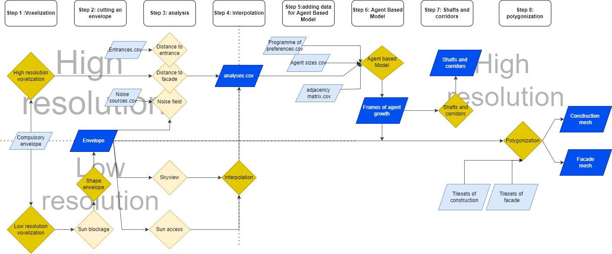

### Process of Massing

Here we show the process in code of our massing. The rombuses show the different notebooks. The rectangles show in- or outputs. 
The code exists of eight parts, with the first seven that are part of the massing.

* Voxelization
* cutting an envelope
* Analysis
* Interpolation
* Adding data for ABM-model
* Agent Based growth Model
* Shafts and corridors
* Polygonization

    
*code flowchart* 

The steps Analysis, ABM and shafts and corridors will be discussed in this chapter, massing. 

---

    

---