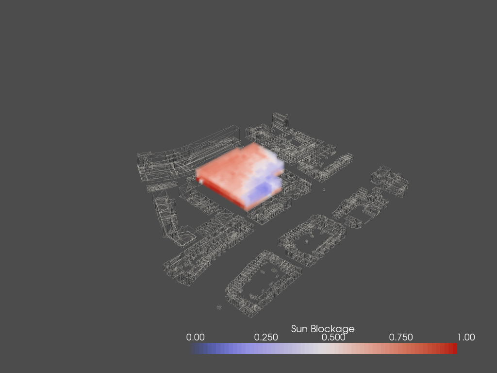
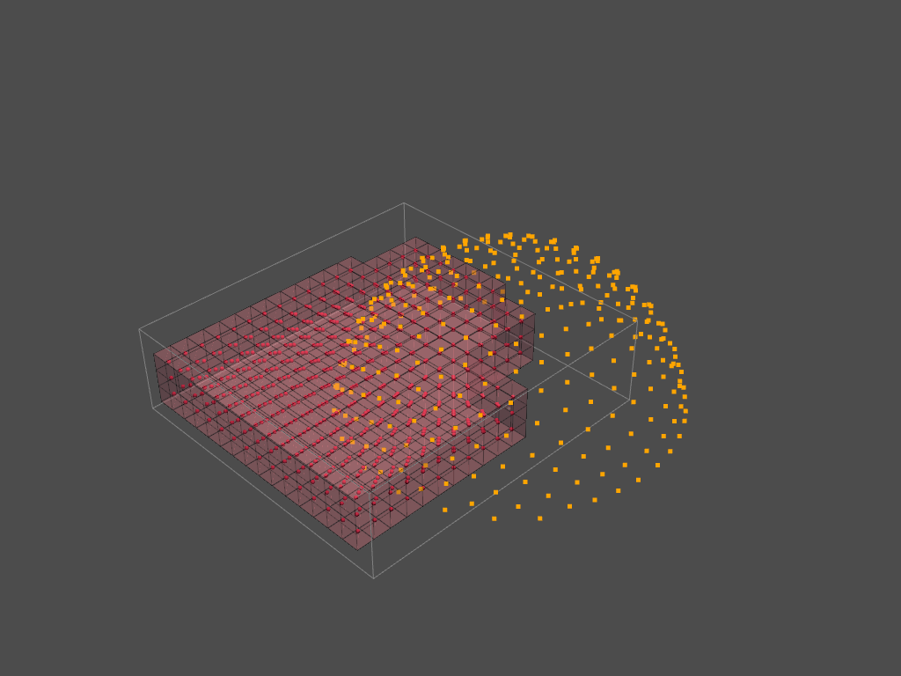
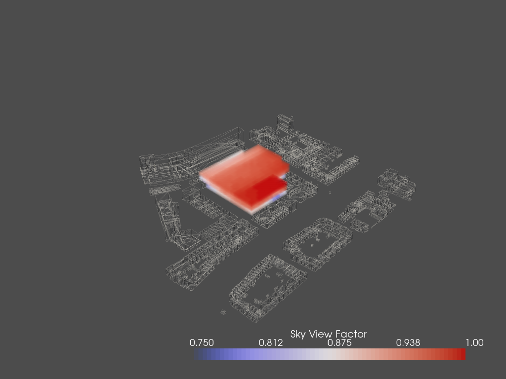

# **The Spatial Analysis**

The spatial analysis consists of the calculations for  

* Solar envelope
* Sky view factor
* Distance to facade

* Distance to entrance
* Noise fied from street


## **The Solar Envelope**

The Solar Envelope is one word for both sun light access and shadow analysis. The shadow analysis will furthermore be used in shaping of the envelope.

### **Sun Light Access**

For the sun light we choose 4 days representing 4 typical days in 4 seasons at the building's location.  

```python
sp = Sunpath(longitude=4.3571, latitude=52.0116)

hoys = []
sun_vectors = []
day_multiples = 90

for d in range(365):
    if d%day_multiples==0:
        for h in range(24):
            hoy = d*24 + h
            sun = sp.calculate_sun_from_hoy(hoy)
            sun_vector = sun.sun_vector.to_array()
            if sun_vector[2] < 0.0:
                hoys.append(hoy)
                sun_vectors.append(sun_vector)
```

Then we set the sun light to the reverse direction and shoot them from each voxel of the lattice.  

```python
sun_dirs = -np.array(converted_sun_vectors)
vox_cens = envelope_lattice.centroids

for v_cen in vox_cens:
    for s_dir in sun_dirs:
        ray_dir.append(s_dir)
        ray_src.append(v_cen)
```

Finally we count the percentage that those rays will be blocked.

```python
sun_access = 1.0 - int_count/sun_count 
```

<center>
    
</center>

### **Shadowing**

The shadow casted by this building is done by a similar idea. The only thing changed was to choose the original sun light directions (instead of reversed ones), such that from those rays shooted, we can know the percentage of time how the building could possibly block sun light for the surrounding buildings.   

<center>
    
</center>

## **The Sky View Factor**

The sky view factor means the percentage of open sky we can see at a specific point. In places like midtown Manhatten, the sky view factor is very low due to the large amount of sky scrapers. And in comparison, in the middle of a desert the sky view factor and be close to 1, as there is no blockage anywhere.  

This idea can be useful in tackling Urban Heat Island Effect. It is also interesting to use it for other interesting measures.  

The implementation of it is rather simple. Using the same library as above, we can create a semisphere of rays.  

<center>
    
</center>

Then we compute the percentage that those rays hit the surroundings.

<center>
    
</center>


## **The Distance to Facade**