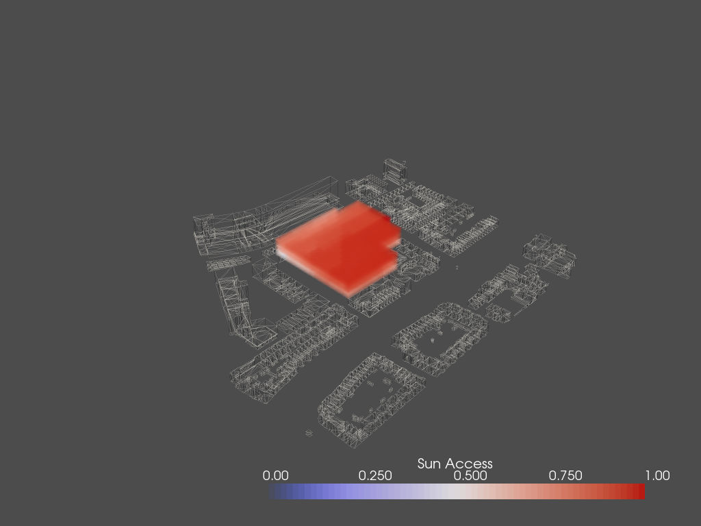
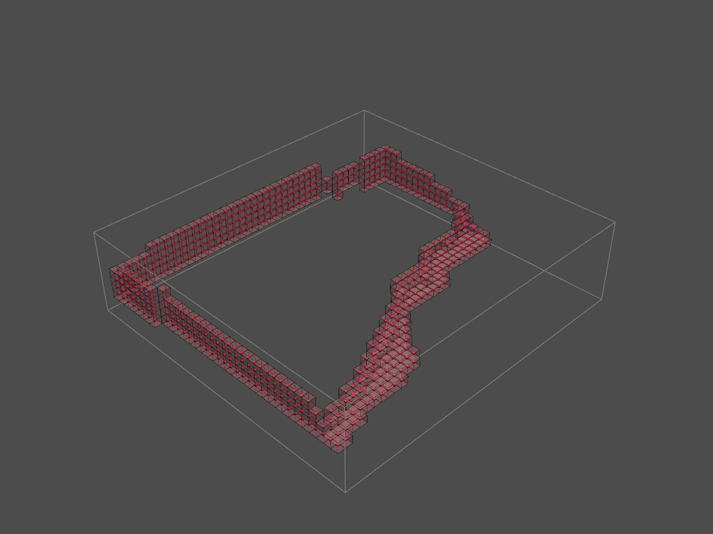

# **The Spatial Analysis**

The spatial analysis consists of the calculations for  

* Distance to entrance
* Noise field from street

* Solar envelope
* Sky view factor
* Distance to facade

## **The Distance to Entrance**

(Place Holder @Paolo)

## **The noise field from street**

(Place Holder @Paolo)

## **The Solar Envelope**

The Solar Envelope is one word for both sun light access and shadow analysis. The shadow analysis will furthermore be used in shaping of the envelope.

### **Sun Light Access**

For the sun light we choose 4 days representing 4 typical days in 4 seasons at the building's location.  

```python
sp = Sunpath(longitude=4.3571, latitude=52.0116)

hoys = []
sun_vectors = []
day_multiples = 90

for d in range(365):
    if d%day_multiples==0:
        for h in range(24):
            hoy = d*24 + h
            sun = sp.calculate_sun_from_hoy(hoy)
            sun_vector = sun.sun_vector.to_array()
            if sun_vector[2] < 0.0:
                hoys.append(hoy)
                sun_vectors.append(sun_vector)
```

Then we set the sun light to the reverse direction and shoot them from each voxel of the lattice.  

```python
sun_dirs = -np.array(converted_sun_vectors)
vox_cens = envelope_lattice.centroids

for v_cen in vox_cens:
    for s_dir in sun_dirs:
        ray_dir.append(s_dir)
        ray_src.append(v_cen)
```

Finally we count the percentage that those rays will be blocked.

```python
sun_access = 1.0 - int_count/sun_count 
```

<center>
    
</center>

### **Shadowing**

The shadow casted by this building is done by a similar idea. The only thing changed was to choose the original sun light directions (instead of reversed ones), such that from those rays shooted, we can know the percentage of time how the building could possibly block sun light for the surrounding buildings.   

<center>
    
</center>

## **The Sky View Factor**

The sky view factor means the percentage of open sky we can see at a specific point. In places like midtown Manhatten, the sky view factor is very low due to the large amount of sky scrapers. And in comparison, in the middle of a desert the sky view factor and be close to 1, as there is no blockage anywhere.  

This idea can be useful in tackling Urban Heat Island Effect. It is also interesting to use it for other interesting measures.  

The implementation of it is rather simple. Using the same library as above, we can create a semisphere of rays.  

<center>
    
</center>

Then we compute the percentage that those rays hit the surroundings.

<center>
    
</center>


## **The Distance to Facade**

The distance to facade means basically the closest distance from the voxel to outside. By calculating the inner voxels, we get the lattice of the facade.

<center>
    
</center>

Then we calculate the euclidian distance from the voxel to every facade points. Even though I did not manage to do a manifold one, the end result shall be identical.

<center>
    
</center>

## **Pesudocode**

We provide Pesudocode for this part

### **The Solar envelope**

```python
# initialization
import numpy, topogenesis, ladybug, ...
load optional_envelope.obj, immediate_context.obj
read voxelized_envelope_lowres.csv & transform to envelope_lattice

# compute sum vectors
set latitude & longitute
for the first day of each season:
    for 24 hours:
        calculate sun_vector
        if sun_vector below horizontal:
            add sun_vector
rotate sun_vector by 36.324

# create sun directions and sun sources
for cen in voxel_cens:
    for sun_dir in sun_vector:
        ray_src.append(cen)
        ray_dir.append(sun_dir)
(do the same but negative to obtian ray_dir2)

# calculation
tri_id, ray_id = context_mesh.ray.intersects_id(ray_src, ray_dir, multiple_hits=False)
tri_id2, ray_id2 = context_mesh.ray.intersects_id(ray_src, ray_dir2, multiple_hits=False)

# calculate the percentage of hitting
for voxels:
    for rays:
        add hits to the corresponding voxel
    compute hits/(total rays)
    store the result

# transform to a lattice
for flattened avail lattice:
    if avail:
        append the percentage
    else:
        append 0
reshape to create a lattice

# visualization and saving
visualize
save to csv
```

### **The sky view factor**

```python
# initialization
import numpy, topogenesis, ladybug, ...
load optional_envelope.obj, immediate_context.obj
read voxelized_envelope_lowres.csv & transform to envelope_lattice

# compute sum vectors
create icosphere
if icosphere above horizontal:
    add sun_vector

# The Latter part is identical to solar_envelope file

# create sun directions and sun sources
for cen in voxel_cens:
    for sun_dir in sun_vector:
        ray_src.append(cen)
        ray_dir.append(sun_dir)

# calculation
tri_id, ray_id = context_mesh.ray.intersects_id(ray_src, ray_dir, multiple_hits=False)

# calculate the percentage of hitting
for voxels:
    for rays:
        add hits to the corresponding voxel
    compute hits/(total rays)
    store the result

# transform to a lattice
for flattened avail lattice:
    if avail:
        append the percentage
    else:
        append 0
reshape to create a lattice

# visualization and saving
visualize
save to csv
```

### **The Distance to Facade**

```python
# initialization
import numpy, topogenesis, ...

# load lattice
read lattice.csv & transform to lattice

# find the facade
define stencil

insider = []
for i in lattice.find_neighbors(stencil):
    inside = True
    for n in i:
        if n is not avail:
            inside = False
    if inside:
        insider.append(i)

facade = avail_lattice
for i in insider:
    facade[i[0],i[1],:] = False

# calculate distance to facade
define lattice_cens, facade_locs

dist_m = []
for voxel_cen in lattice_cens:
    dist_v = []
    for facade_cen in facade_locs:
        dist_v.append(distance voxel_cen to facade_cen)
    dist_m.append(dist_v)
min_dist = np.array(dist_m).min(axis=1)

make min_dist a lattice: envelope_eu_dist_lattice
envelope_eu_dist_lattice += 1

# visualization and saving
visualize
save to csv
```