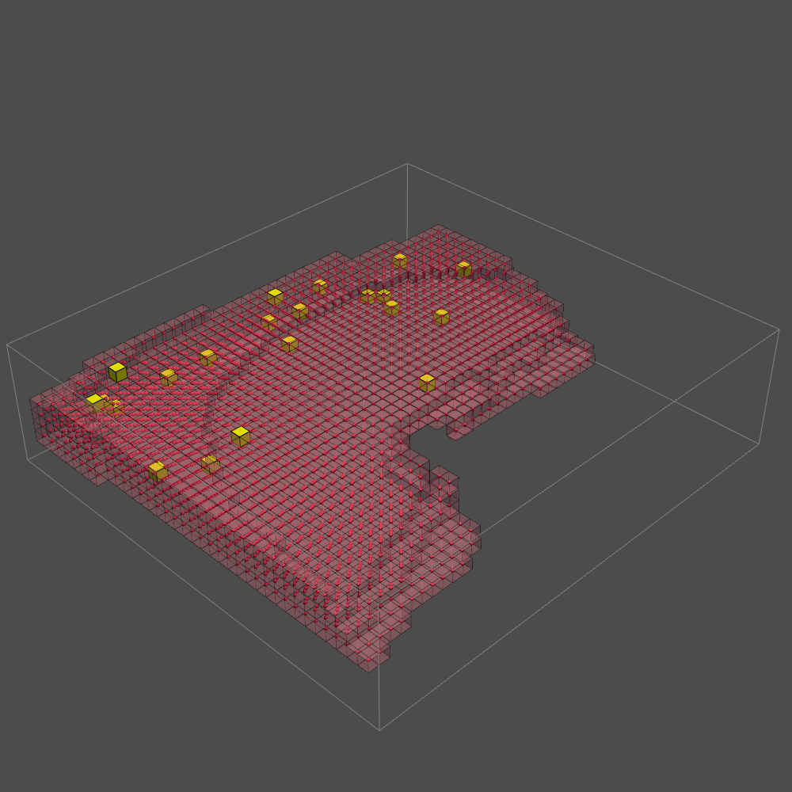
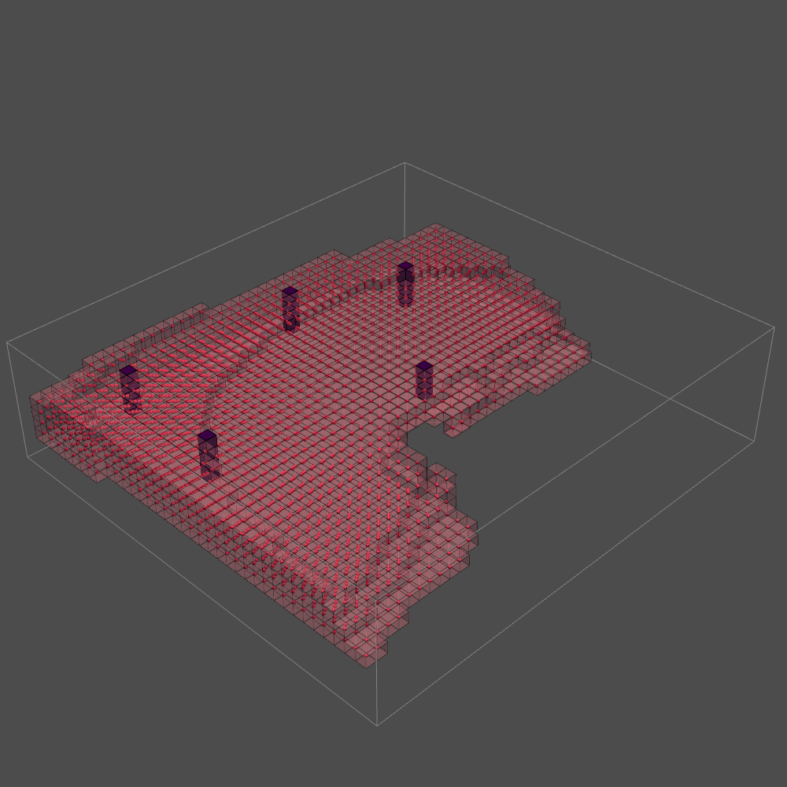
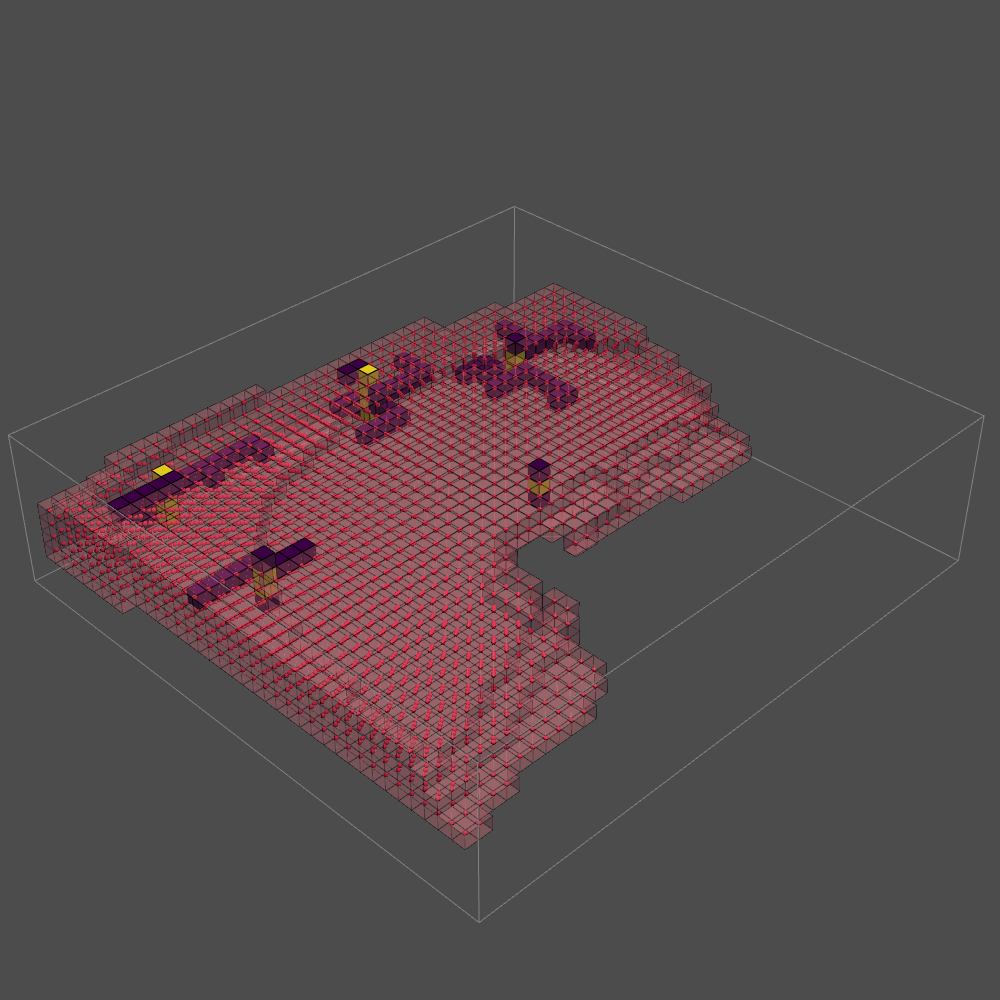

# **Shafts and corridors placement**

The shafts and corridors have been placed after the Agent Based growth Model was finished. It happened in three seperate parts. First cluster centers were calculated, then some shafts were placed and ultimately the corridors.

The cluster centres were calculated with the following code:

```python
for each agent:
    agent_locations = np.where
    number_clusters = len(agent_locations / 100 +1)
    kmeans = kmeans(nnumber_clusters)
    cluster_centers.append()
```
This gives the following cluster centres:
<center>
    
</center>

After these clusters were calculated, five shafts had to be placed. This was also done with kmeans. The following pseudocode gives an insight in the code:

```python
again, kmeans = kmeans(n_clusters=5)
for cluster:
    shaft_lattice = 1
```

This code placed the following shafts:
<center>
    
</center>

When the shafts are determined, the corridors can be made. The corridors are only horizontal, and find the shortest path with the connectivity graph. The pseudocode explains how:

```python
# make adjacency matrix

for all voxels:
    voxel_neighbours = avail_latt.find_neighbours_masked(stencil)
    for each neighbour:
        if avail_latt[neighbour] == 1:
            adjacency_list.append()

Make connectivity graph

# corridor growth

for all clusters:
    slice horizontally
    for each shaft:
        find shortest path to cluster with connectivity graph

for each level:
    find the shafts
    for each shaft:
        construct destination and source
    for each destination:
        find shortest path to a source(shaft) with connectivity graph
```
This gives the following corridors and shafts:

<center>
    
</center>