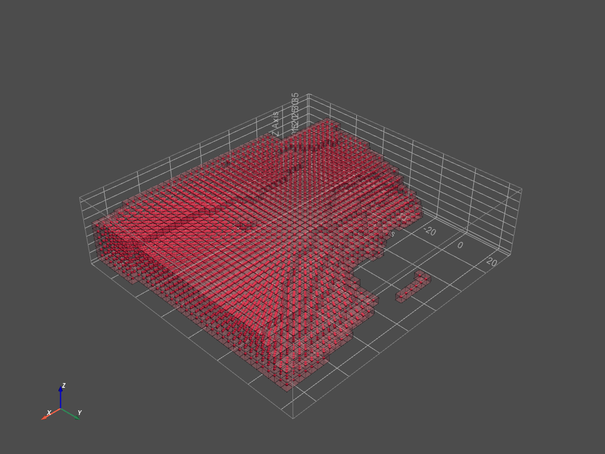
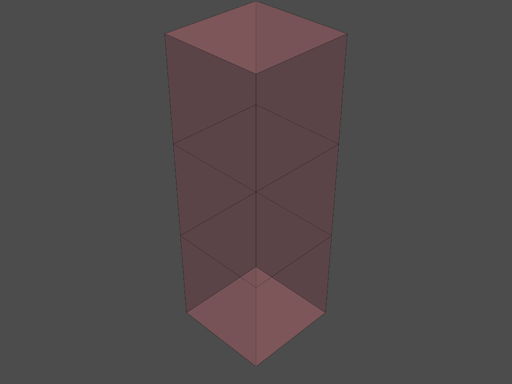
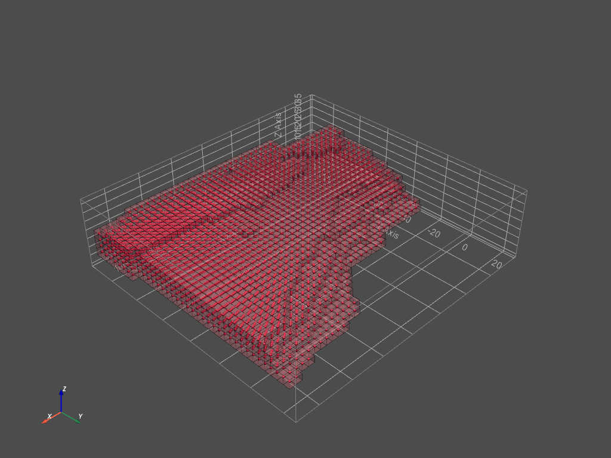
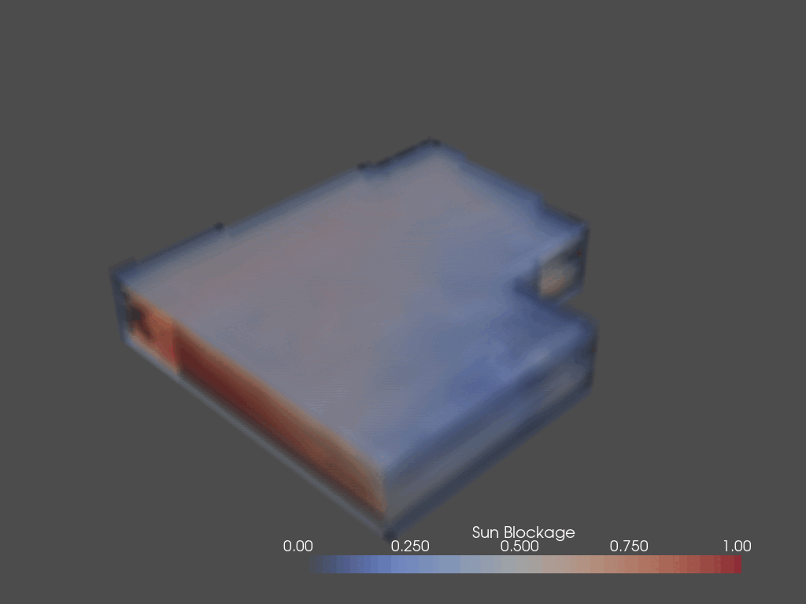

The Shaping of the envelope is basically determinded by the shadow that the building will cast on the surroundings.  

Instead of making a threshold, we do it based on an idea that we should cut as much voxels as we can. So we use the shadowing as the "instruction for where to cut."  

All agents combined would be 3608 voxels (1.8x1.8x1.8). However, we need some extra spaces for the agent based model to grow and adjust. As a result, we set the value to be approximately 1.6 of that value, giving us ultimately 5773 voxels needed.  

We selected the nearest and larger sized envelope that has 6870 voxels, which is equivalent to a threshold value of 0.44.  

Then we get the following envelope.

<center>
    
</center>

However, we can see a lot of floating voxels here. To remove those floating voxels, we define a stencil that checks only upper and lower neighbor.

<center>
    
</center>

If both upper and lower neighbour is empty, we remove the voxel. Here gives the final envelope.

<center>
    
</center>

##  Pseudocode 

We provide Pseudocode for this part.

```python
# initialization
import topogenesis, numpy, pandas, ...

# load the interpolated lattice
read sun_blockage.csv & turn into sunblockage_lattice_hi

# create different lattice from threshold
n_frames = 25
for i in range(0,n_frames+1):
    frames.append(sunblockage_lattice_hi > i/25)

# calculate how many voxels inside
n_voxel = []
for frame in frames:
    n_voxel.append(sum(np.array(frame).flatten()))

# choose threshold based on how many voxel needed
base_lattice = frame[14]

# visualization and saving
visualize
save to csv
```

This is the result:

<center>
    
*GIF of blockage analysis, shaping and final envelope*
</center>

---
<center>
    
</center>
---