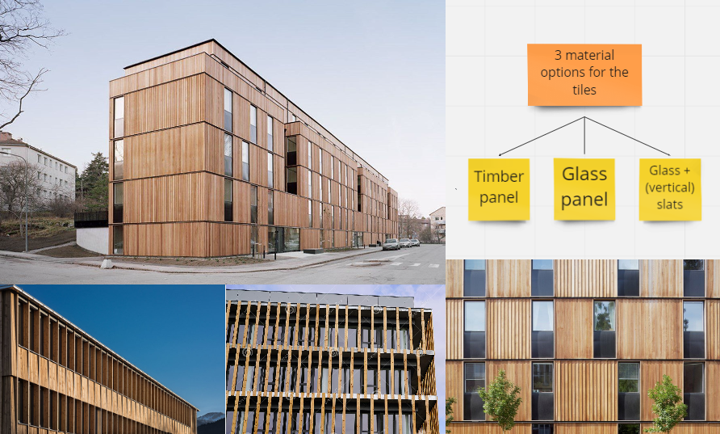
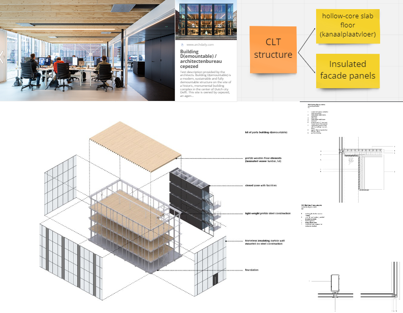

For the architectural part of this project, we wanted to look into the sustainable design goals we have mentioned before. One of our design principles was themed Sustainability, so for the Forming part we looked into sustainable options.

### Sustainable material
The first goal is to usesustainable materials, to make sure we have the lowest carbon footprint we can. For the materials we quickly came to the conclusion that we wanted to use wood to build our facade. In the image below, our inspirations can be seen.

    

### Deconstructable
The second goal is to make a facade that is deconstructable so that the elements can be re-used for future projects. For this we looked at other projects that used a deconstructable facade and we came to the conclusion that we should be making a construction on which we can hang or click the facade. This idea will be explained deeper in the Products part. The image below shows our inspiration board.

    

