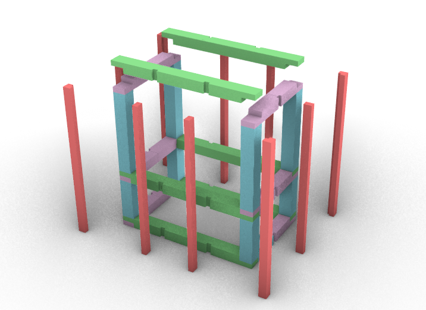
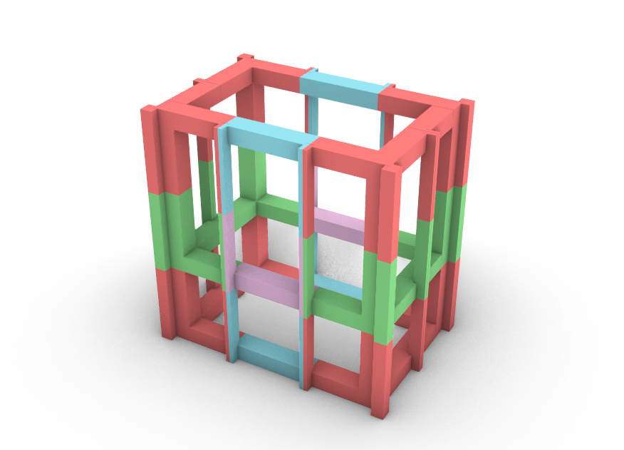
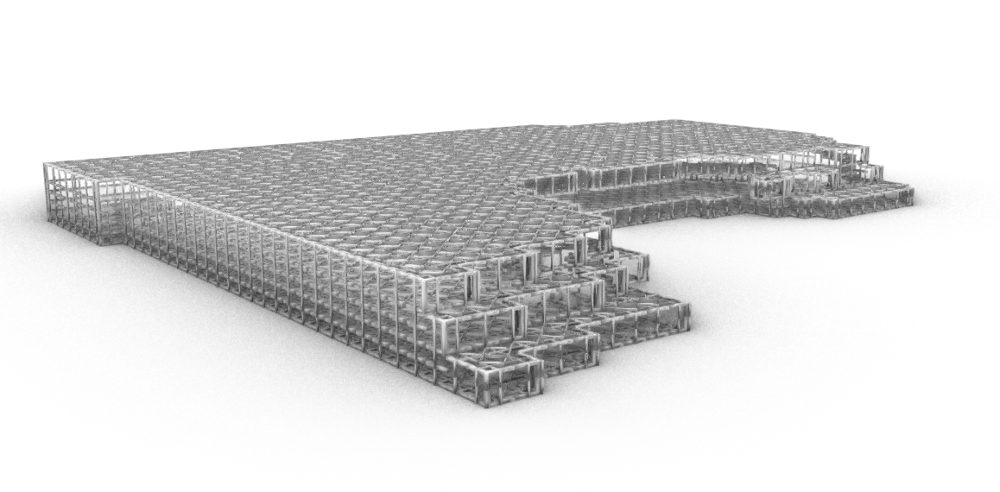

For the construction to be deconstructable, we researched methods to make a lightweight framework that is detachable. In our case we went with wood. 

    

The picture above shows the different elements of the framework. The green and purple parts are loadbearing beams. The parts in blue are the loadbearing column. And the last part, the parts in red are the slats the facade can be attached to. All these different elements fit into each other like pieces of a puzzle, so they can be easily taken apart and the need for extra materials to form connections, is very low.

    

The tileset that was used in the code is shown above. With this time in red, the cornertiles. The green are vertical edgetiles. The blue are horizontal edgetiles. And the purple are surface tiles.

    

The output of the polygonisation workshop combined with our structural tileset results in the image that's showed above. There is also a roof/floor structure added. 
Optimally, we would have liked to also make a tileset for the inside of the building, since a real loadbearing structure should also support inner walls, not only the outer ones as it is now. This will be further discussed on the Future page.