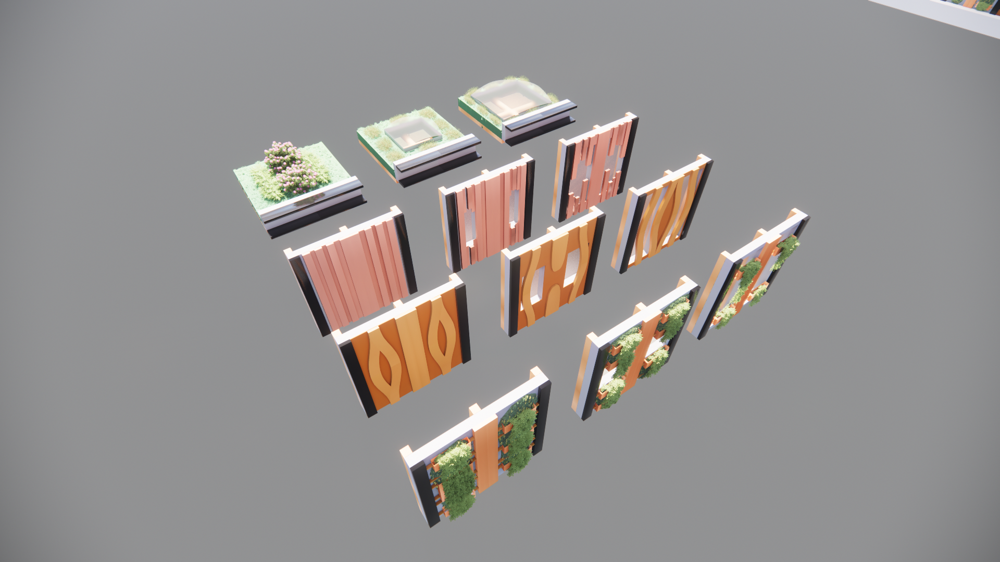
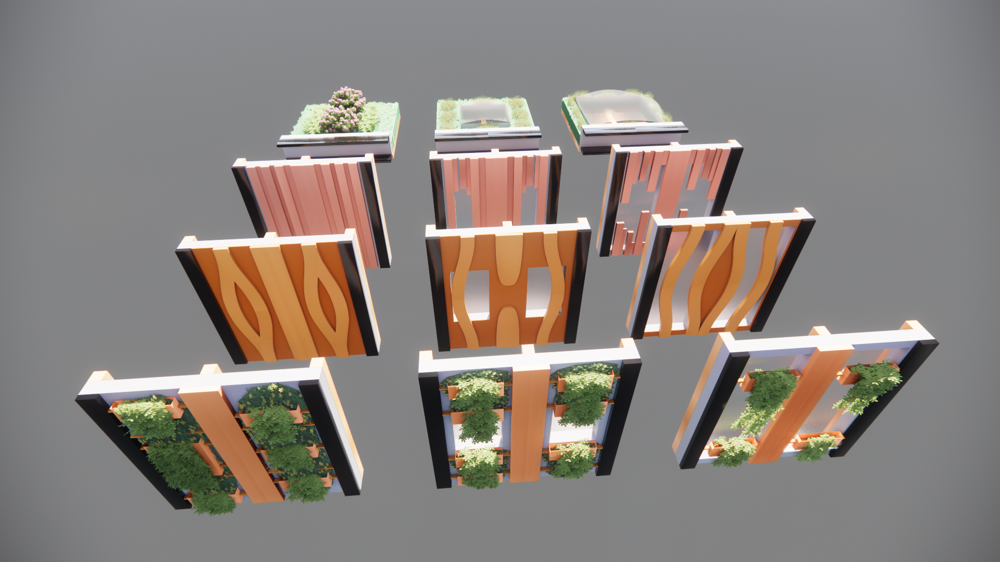
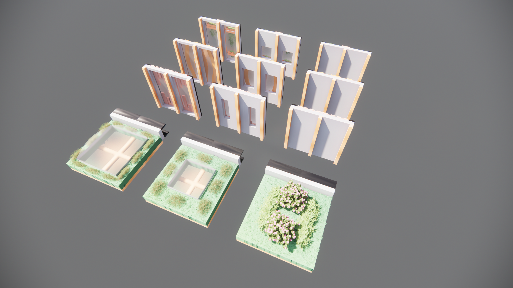
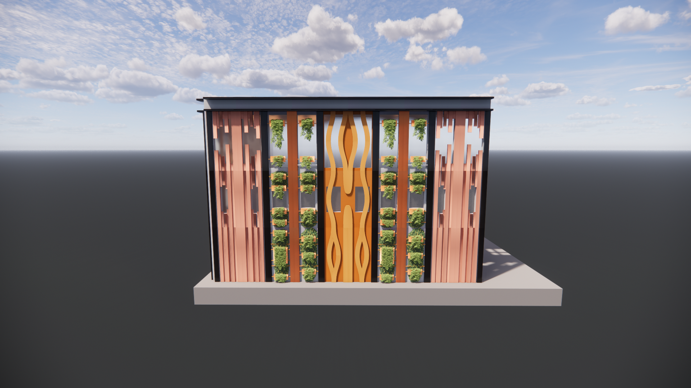
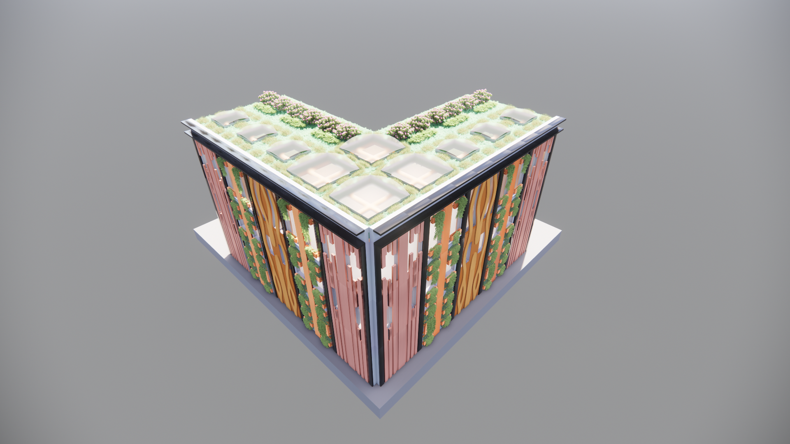

### The facade in the model

    

 This picture shows the model we imported in Rhino 7. As you can see, the model looks like a normal building. The model is three stories high. The facade is made with certain elements that can be fit together and also can be detached from each other. This ensures that the facade can be changed when necessary and also can be re-used when this building is getting demolished. Our idea was to implement a facade that could change and interact depending on the facility behind a particular part of the building. Unfortunately we were not able to actually use it in our code. Therefore, we made a facade with only one element.  

    

When you look closer to the facade, it is noticable how the facade looks like. Because we used different types of wooden slats, the facade gets more depth and looks layered. We chose this design because the building gets a lot more interesting when using this depth-changing design. We also used a roof edge to make the roof and the sides of the building stand out.  

    

You can see on this picture that the building has the sides that are straight, and one side that looks like its caved in the building. This receding facade allows us to make a park where all the people can come together and meet each other. Hereby we can realise our goal that the building should contribute to the neighbourhood improvement. By making a park which is available for everyone 24/7, we make sure that the neighbourhood has a place where current living families can come together with the new people of our building.

    

This is the final tileset we chose to use in the model. With the help of the elements the facade gets structured in a strict grid. Thanks to this grid, the building could be built quickly. We would have liked to make the facade a little more challenging by using different types of design within the facade. 

### The different types of facades

    

    

    

    

    

### Recommendations
We would have liked to make the facade a little more challenging by using different types of design within the facade, for example we would have liked to use more closed tiles on agents like the cinema, but more open and translucent tiles for agents that are more public. This idea would require us to come up with a solution that, somehow, lets the boolean marching cubes know where to put the open tileset and where to put the closed tileset. Unfortunately we were not able to actually get this working but we have a general idea of how to go to work. A method to do this could be as following: Start by designing the different tilesets you would like to use and save each set in their own folder. Make a new notebook for every tileset, this is an easy way to organise this method a bit. (make sure the names of the tilesets and notebooks are easily distinguishable, for your own sake ;)) Then, for all the agents in your list of agents, export an CSV of the voxels. Make sure to do this for every agent individually! Then you would have to hand select which agent gets which tileset and put the correct CSV's in the corresponding notebooks. This might also be possible in code, if you give the agents a value of openess of facade and then let the code figure out "if this value is higher than the treshold that is set, then it gets the most open tileset". Now you can get an OBJ file from the notebooks that has wrapped your agent in the tileset that you have designed for it! When all the agents are done and have a facade, all the OBJ's can be combined to form a nice building with a more complex facade!

   

