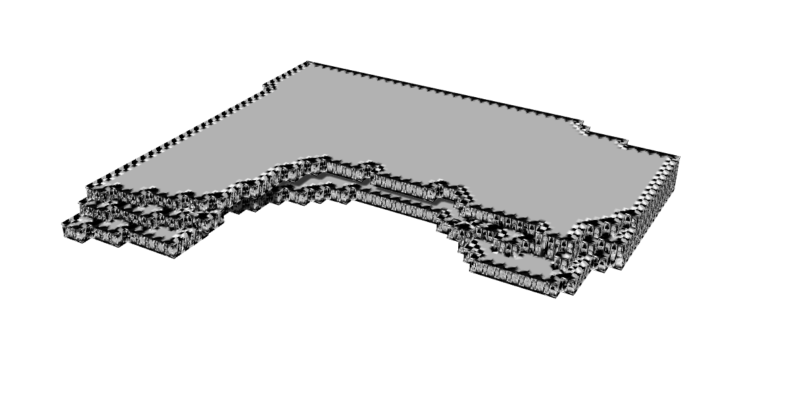
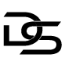

    

 This picture shows the model we imported in Rhino 7. As you can see, the model looks like a normal building. The model is three stories high. The facade is made with certain elements that can be fit together and also can be detached from each other. This ensures that the facade can be changed when necessary and also can be re-used when this building is getting demolished. Our idea was to implement a facade that could change and interact depending on the facility behind a particular part of the building. Unfortunately we were not able to actually use it in our code. Therefore, we made a facade with only one element.  

    

When you look closer to the facade, it is noticable how the facade looks like. Because we used different types of wooden slats, the facade gets more depth and looks layered. We chose this design because the building gets a lot more interesting when using this depth-changing design. We also used a roof edge to make the roof and the sides of the building stand out.  

    

You can see on this picture that the building has the sides that are straight, and one side that looks like its caved in the building. This receding facade allows us to make a park where all the people can come together and meet each other. Hereby we can realise our goal that the building should contribute to the neighbourhood improvement. By making a park which is available for everyone 24/7, we make sure that the neighbourhood has a place where current living families can come together with the new people of our building.

    

This is the final tileset we chose to use in the model. With the help of the elements the facade gets structured in a strict grid. Thanks to this grid, the building could be built quickly. We would have liked to make the facade a little more challenging by using different types of design within the facade. This idea is further explained under the heading future.  

   

