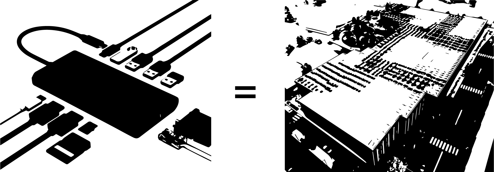
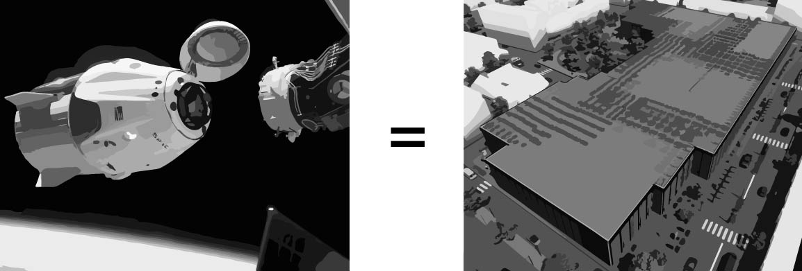
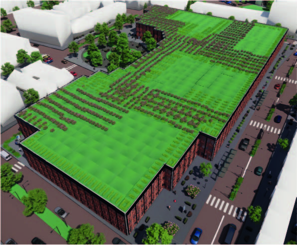

<center>
    
</center>

<center>
## Welcome to the home of the Docking Station
#### Spatial Computational Design 4.0
<center>

The Docking Station is a building which has simularities with a docking station for your laptop. Before the use of a docking station, one has many different inputs and many different cables running to a laptop. Each cable has its own characteristics and importance. When one is using a docking station, every cable and input is combined in a small device which turns all these different inputs into one output. The process of combining a lot of different inputs, thoughts and ideas to one output, our building, is why this analogy fits our project.

<center>
    
</center>

In addition to this analogy, we think that the name Docking Station also shows our desire to make the building modular. Just forget the idea of a docking station for a laptop for a second and imagine a docking station for spaceships in outer space. A whole different scale and a whole different concept. These distinct buildings in space can't be build all at ones. Each time a cargo flight arrives with new parts and modules, the docking station expands. This concept can also be found in our building. For example, this concept is reflected in the demountable facade that we tried to implement in the building. The idea behind the facade is that different elements have the same measurements and can be placed in many different setups. Even with different characteristics to match the facilities behind the facade. This creates a comparable modularity of a space station. 

<center>
    
</center>

This is the website of group 1 of the Spatial Computing project, as a part of the minor Spatial Computing in Architectural Design of the faculty Architecture and the Built Environment of the TU Delft. Our group is part of the fourth generation students working on this minor. On this site, we will document our process and show our products during this course. The project is divided in to four phases: Planning, Configuring, Massing and Forming. Finally, we will show our ideas for the future of the minor, stating some ideas we think that are interesting to investigate for future minor students.  

<center>
    
</center>

#### Our starting point
``` python

The following program of requirements has been given: 

Housing: 
o Student Housing 80 units 
o Assisted Living 30 units 
o Starter Housing 100 units

• Communal Spaces:
o Underground Parking (minimum of 0.5 parking lots per 
apartment) 
o Vegetation (minimum 30% of the plot) 
o Workshops/Fab-Labs/Co-working Space and Start-up Offices  
o Library + Cinematheque + Café/Pub + [pinball] Arcade 
o Co-cooking/Restaurant 
o Community Centre 
o Shop (grocery, tools and crafts) 
o [electricity producing/odourless /geek-friendly] Gym
```


